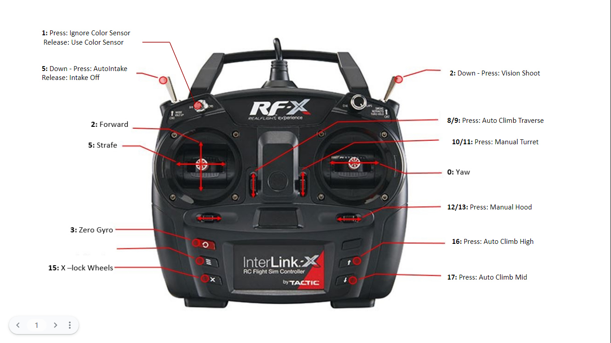
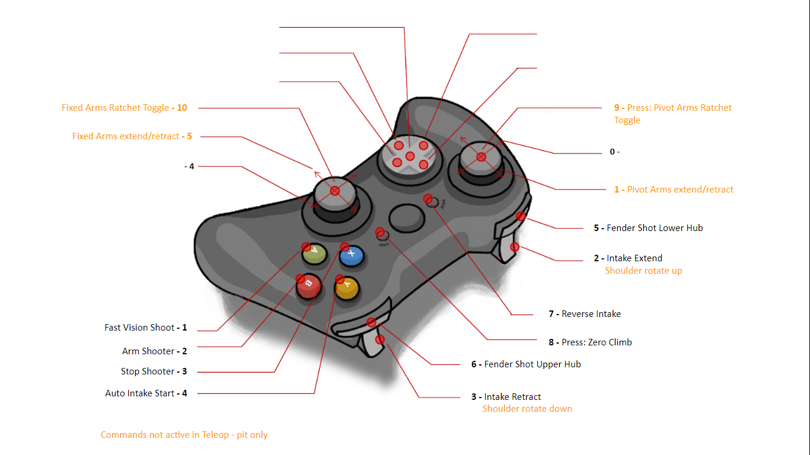

# 2022 FIRST RAPID REACT

## Controls

## Talons

| Subsystem | Type | Talon           | ID  | PDP | Motor  | Breaker |
| --------- | ---- | --------------- | --- | --- | ------ | ------- |
| Drive     | SRX  | azimuth         | 0   |  11 | 9015   |  30     |
| Drive     | SRX  | azimuth         | 1   |  18 | 9015   |  30     |
| Drive     | SRX  | azimuth         | 2   |  13 | 9015   |  30     |
| Drive     | SRX  | azimuth         | 3   |  16 | 9015   |  30     |
| Drive     | FX   | drive           | 10  |  12 | Falcon |  40     |
| Drive     | FX   | drive           | 11  |  17 | Falcon |  40     |
| Drive     | FX   | drive           | 12  |  14 | Falcon |  40     |
| Drive     | FX   | drive           | 13  |  15 | Falcon |  40     |
| Intake    | FX   | intake          | 20  |  8  | Falcon |  40     |
| Intake    | SRX  | intakeExtend    | 21  |  2  | 550    |  30     |
| Magazine  | FXn  | lowerMagazine   | 30  |  9  | Falcon |  30     |
| Magazine  | SRX  | upperMagazine   | 31  |  5  | 550    |  30     |
| Shooter   | FX   | shooter         | 40  |  6  | Falcon |  40     |
| Shooter   | FX   | kicker          | 41  |  4  | Falcon |  40     |
| Shooter   | SRX  | hood            | 42  |  7  | 550    |  30     |
| Turret    | SRX  | turret          | 50  |  4  | 550    |  30     |
| Climb     | FX   | pivotArm        | 60  |  0  | Falcon |  40     |
| Climb     | FX   | fixedArm        | 61  |  10 | Falcon |  40     |
| Climb     | SRX  | shoulder        | 62  |  1  | 550    |  30     |

* Lower beam break: lower magazine forward limit
* Upper beam break: upper magazine forward limit
* Turret banana sensor : turret forward limit
* Hood zero sensor : hood forward limit
* Shoulder zero sensor: shoulder forward limit

## Roborio

| Subsystem | Interface | Device      |
| --------- | --------- | ----------- |
| Drive     | SPI/MXP   | NAVX        |
| Magazine  | I2C/MXP   | ColorSensor |

## PWM

| Subsystem | name         | ID |
| --------- | ------------ | -- |
| Climb     | PivotRatchet | 0  |
| Climb     | FixedRatchet | 1  |

## DIO
| Subsystem | name        | ID |
| --------- | ----------- | -- |
| Climb     | leftArmHome  | 0 |
| Climb     | rightArmHome | 1 |

## Deadeye Vision System
See the [README](./deadeye/README.md) in `/deadeye`.
